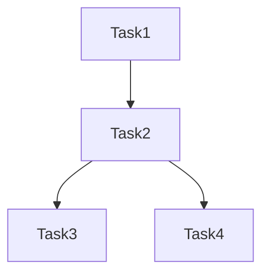

# Workflow Grouping Composition

A Python module for intelligently grouping workflow tasks based on their resource requirements and dependencies. This tool analyzes task characteristics and dependencies to optimize workflow execution by grouping compatible tasks together.

Research for: Optimizing Heterogeneous Workflow Construction for Enhanced Event Throughput and Efficient Resource Utilization in CMS

## Overview

The Workflow Task Grouper analyzes workflow tasks and their relationships to create optimal task groups while respecting both hard constraints (OS compatibility, architecture requirements) and soft constraints (resource utilization, performance characteristics).

## Features

- Task dependency analysis using directed acyclic graphs (DAG)
- Resource compatibility checking
- Configurable scoring system for group optimization
- Support for various resource types (CPU, Memory, GPU)
- Visualization of workflow DAG structure (ASCII and Mermaid formats)
- Customizable weights for different scoring aspects

## Installation

```bash
# Clone the repository
git clone <repository-url>
cd workflow-task-grouper

# Install dependencies
pip install -r requirements.txt
```

## Task Grouping Algorithm

The task grouping algorithm implemented in `group_tasks.py` follows these key steps:

### 1. DAG Construction
- Creates a directed acyclic graph (DAG) representing task dependencies
- Each node represents a task
- Edges represent dependencies between tasks (input/output relationships)

### 2. Group Formation
The algorithm forms groups iteratively:

1. **Initial Selection**:
   - Starts with the task that has the most dependencies (predecessors + successors)
   - This prioritizes tasks that are more interconnected in the workflow

2. **Group Expansion**:
   For each potential task to add to the group, the algorithm checks:

   a. **Hard Constraints**:
   - OS version compatibility
   - CPU architecture compatibility
   - Existence of dependency paths between tasks

   b. **Soft Constraints** (Scoring System):
   - CPU utilization efficiency
   - Memory compatibility
   - Processing throughput alignment
   - Accelerator (GPU) requirements

   c. **Dependency Path Validation**:
   - Ensures all intermediate tasks in dependency paths are included in the group
   - Maintains workflow coherence within groups

### 3. Scoring System

Groups are evaluated using a weighted scoring system (`GroupScore` class) that considers:

- **CPU Score**: Efficiency of CPU core utilization
- **Memory Score**: Compatibility of memory requirements
- **Throughput Score**: Alignment of processing speeds
- **Accelerator Score**: GPU requirement compatibility

Each aspect can be weighted differently using customizable weights, with scores normalized to [0,1].

### 4. Group Finalization

A task is added to a group if:
1. It passes all hard constraints
2. The group's total score remains above the minimum threshold (default: 0.7)
3. All dependency paths between tasks in the group are complete

## Usage

```python
from src.group_tasks import create_workflow_from_json

# Load your workflow JSON
with open("workflow.json", "r") as file:
    workflow_data = json.load(file)

# Create groups with custom minimum score
groups, tasks = create_workflow_from_json(workflow_data, min_group_score=0.7)
```

## Testing

The project includes test suites for different workflow patterns:
- Sequential workflows (`tests/test_sequential.py`)
- Fork workflows (`tests/test_fork.py`)

Run tests using:
```bash
python -m pytest tests/
```

## Visualization

The module supports two visualization formats for workflow DAGs:

### ASCII Format

```
Task1
|-- Task2
    |-- Task3
    |-- Task4
```

### Mermaid Format


## Contributing

Contributions are welcome! Please feel free to submit a Pull Request.

## License

[Add your license information here]