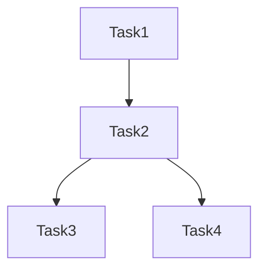

# Workflow Grouping Composition

A Python module for intelligently grouping workflow tasks based on their resource requirements and dependencies. This tool analyzes task characteristics and dependencies to optimize workflow execution by grouping compatible tasks together.

Research for: Optimizing Heterogeneous Workflow Construction for Enhanced Event Throughput and Efficient Resource Utilization in CMS

## Overview

The Workflow Task Grouper analyzes workflow tasks and their relationships to create optimal task groups while respecting both hard constraints (OS compatibility, architecture requirements) and soft constraints (resource utilization, performance characteristics). The system also generates all possible workflow constructions and provides comprehensive analysis and visualization capabilities.

## Features

- Task dependency analysis using directed acyclic graphs (DAG)
- Resource compatibility checking
- Configurable scoring system for group optimization
- Support for various resource types (CPU, Memory, GPU)
- Visualization of workflow DAG structure (ASCII and Mermaid formats)
- Customizable weights for different scoring aspects
- **NEW**: Generation of all possible workflow constructions
- **NEW**: Comprehensive workflow construction analysis and comparison
- **NEW**: Mermaid-based HTML workflow topology visualization
- **NEW**: Storage rules and data volume calculation
- **NEW**: Events per job calculation based on target wallclock time

## Installation

```bash
# Clone the repository
git clone <repository-url>
cd workflow-task-grouper

# Install dependencies
pip install -r requirements.txt
```

## Task Grouping Algorithm

The task grouping algorithm implemented in `group_tasks.py` follows these key steps:

### 1. DAG Construction
- Creates a directed acyclic graph (DAG) representing task dependencies
- Each node represents a task
- Edges represent dependencies between tasks (input/output relationships)

### 2. Group Formation
The algorithm forms groups iteratively:

1. **Initial Selection**:
   - Starts with the task that has the most dependencies (predecessors + successors)
   - This prioritizes tasks that are more interconnected in the workflow

2. **Group Expansion**:
   For each potential task to add to the group, the algorithm checks:

   a. **Hard Constraints**:
   - OS version compatibility
   - CPU architecture compatibility
   - Existence of dependency paths between tasks

   b. **Soft Constraints** (Scoring System):
   - CPU utilization efficiency
   - Memory compatibility
   - Processing throughput alignment
   - Accelerator (GPU) requirements

   c. **Dependency Path Validation**:
   - Ensures all intermediate tasks in dependency paths are included in the group
   - Maintains workflow coherence within groups

### 3. Scoring System

Groups are evaluated using a weighted scoring system (`GroupScore` class) that considers:

- **CPU Score**: Efficiency of CPU core utilization
- **Memory Score**: Compatibility of memory requirements
- **Throughput Score**: Alignment of processing speeds
- **Accelerator Score**: GPU requirement compatibility

Each aspect can be weighted differently using customizable weights, with scores normalized to [0,1].

### 4. Group Finalization

A task is added to a group if:
1. It passes all hard constraints
2. The group's total score remains above the minimum threshold (default: 0.7)
3. All dependency paths between tasks in the group are complete

## Usage

```python
from src.group_tasks import create_workflow_from_json

# Load your workflow JSON
with open("workflow.json", "r") as file:
    workflow_data = json.load(file)

# Create groups with custom minimum score
groups, tasks = create_workflow_from_json(workflow_data, min_group_score=0.7)
```

## Testing

The project includes test suites for different workflow patterns:
- Sequential workflows (`tests/test_sequential.py`)
- Fork workflows (`tests/test_fork.py`)

Run tests using:
```bash
python -m pytest tests/
```

## Visualization

The module supports two visualization formats for workflow DAGs:

### ASCII Format

```
Task1
|-- Task2
    |-- Task3
    |-- Task4
```

### Mermaid Format


## Comprehensive Workflow Analysis Module

The `find_all_groups.py` module provides a comprehensive framework for analyzing all possible task groupings and workflow constructions in a workflow. This module generates and analyzes all valid task groupings based on dependency constraints and finds all possible ways to construct workflows from these groups.

### Key Features

- Generates all possible valid task groups based on dependency constraints
- Calculates detailed resource utilization metrics for each group
- **NEW**: Finds all possible workflow constructions (combinations of groups that cover all tasks)
- **NEW**: Calculates comprehensive workflow-level metrics
- **NEW**: Implements storage rules for data volume calculation
- **NEW**: Calculates optimal events per job based on target wallclock time
- Provides comprehensive analysis of CPU, memory, I/O, and dependency patterns
- Supports visualization of grouping strategies and their impacts

### Core Components

1. **Task and Resource Models**:
   ```python
   @dataclass
   class TaskResources:
       os_version: str
       cpu_arch: str
       memory_mb: int
       accelerator: Optional[str]
       cpu_cores: int
       events_per_second: float
       time_per_event: float
       size_per_event: float
       input_events: int
       keep_output: bool  # Whether the task's output needs to be kept in shared storage

   @dataclass
   class Task:
       id: str
       resources: TaskResources
       input_task: Optional[str] = None
       output_tasks: Set[str] = None
       order: int = 0  # Order of the task in the workflow
   ```

2. **Group Metrics Calculation**:
   - CPU utilization and efficiency
   - Memory allocation and efficiency
   - Throughput analysis
   - I/O requirements with storage rules
   - Dependency path analysis
   - Events per job calculation

3. **Workflow Construction Analysis**:
   - Finds all possible combinations of groups that cover all tasks
   - Respects task dependencies between groups
   - Calculates workflow-level metrics including:
     - Event throughput
     - Total data volumes
     - Resource utilization
     - Parallel execution efficiency

4. **Storage Rules**:
   - Input data volume based on parent task's size per event
   - Output data volume for all tasks in the group
   - Stored data volume for tasks with `keep_output=True` or exit point tasks
   - Per-event data volume calculations

5. **Events per Job Calculation**:
   - Based on target wallclock time (default: 12 hours)
   - Calculates optimal events per job for each group
   - Ensures consistent event processing across workflow

### Usage Example

```python
from find_all_groups import create_workflow_from_json

# Load workflow specification
with open("workflow.json", "r") as file:
    workflow_data = json.load(file)

# Generate all possible groups and workflow constructions
groups, tasks, construction_metrics, dag = create_workflow_from_json(workflow_data)

# Each group contains detailed metrics:
{
    "group_id": "group_0",
    "task_ids": ["Task1", "Task2", ...],
    "resource_metrics": {
        "cpu": {
            "max_cores": 4,
            "cpu_seconds": 1200.0,
            "utilization_ratio": 0.75
        },
        "memory": {
            "max_mb": 8000,
            "min_mb": 4000,
            "occupancy": 0.6
        },
        "io": {
            "input_data_mb": 100.0,
            "output_data_mb": 200.0,
            "stored_data_mb": 150.0,
            "input_data_per_event_mb": 0.1,
            "output_data_per_event_mb": 0.2,
            "stored_data_per_event_mb": 0.15
        }
        # ... other metrics
    },
    "events_per_job": 1440
}

# Each construction contains workflow-level metrics:
{
    "total_events": 4320,
    "event_throughput": 0.1234,
    "total_cpu_time": 3600.0,
    "total_stored_data_mb": 450.0,
    "stored_data_per_event_mb": 0.104,
    "num_groups": 3,
    "groups": ["group_0", "group_1", "group_2"]
}

### Analysis Workflow

1. **Workflow Parsing**:
   - Loads workflow specification from JSON
   - Creates task and resource models
   - Builds dependency graph
   - Calculates events per job based on target wallclock time

2. **Group Generation**:
   - Generates all possible valid task groups
   - Validates dependency constraints
   - Calculates metrics for each group including storage rules

3. **Workflow Construction**:
   - Finds all possible combinations of groups that cover all tasks
   - Respects task dependencies between groups
   - Calculates workflow-level metrics

4. **Metrics Calculation**:
   - Resource utilization (CPU, memory)
   - Throughput analysis
   - I/O requirements with storage rules
   - Dependency patterns
   - Parallel execution efficiency

5. **Output Generation**:
   - Returns detailed metrics for all groups and constructions
   - Provides data for visualization
   - Enables comparison of different workflow strategies

## Metrics Analysis and Visualization

The module includes comprehensive metrics analysis and visualization capabilities through `vis_all_groups.py`. This tool generates detailed visualizations to analyze different aspects of task grouping strategies and workflow constructions.

### Installation

```bash
pip install matplotlib seaborn pandas
```

### Available Visualizations

1. **Resource Utilization Analysis** (`resource_utilization.png`):
   - CPU Efficiency vs Group Size
   - Memory Efficiency vs Group Size
   - Overall Resource Utilization vs Group Size
   - CPU vs Memory Efficiency (with group size as bubble size)

2. **Throughput and I/O Analysis** (`throughput_analysis.png`):
   - Total Throughput vs Group Size
   - Throughput Range (Min/Max) vs Group Size
   - Total Output Size vs Group Size
   - Throughput vs Output Size (with group size as bubble size)

3. **Dependency Analysis** (`dependency_analysis.png`):
   - Number of Dependency Paths vs Group Size
   - Average Path Length vs Group Size

4. **Metric Correlation Heatmap** (`metric_correlation.png`):
   - Shows correlations between all metrics
   - Helps identify relationships between different aspects of the grouping

5. **Workflow Construction Analysis** (`workflow_comparison.png`):
   - Group Size Distribution: Shows the distribution of tasks per group in each construction
   - Performance vs Storage Efficiency: Scatter plot showing the trade-off between event throughput and stored data per event
   - Data Flow Analysis: Bar plot comparing input, output, and stored data volumes across constructions
   - Network Transfer Analysis: Shows the total data transferred between groups in each construction
   - CPU Utilization Analysis: Box plot showing the distribution of CPU utilization ratios across groups
   - Memory Utilization Analysis: Bar plot with error bars showing average memory occupancy and its variation
   - Event Processing Distribution: Box plot showing the distribution of events processed per group
   - Parallel Execution Analysis: Shows the parallel efficiency of each construction based on DAG dependencies

6. **Storage Efficiency Analysis** (`storage_efficiency.png`):
   - Storage Efficiency vs Number of Groups
   - Storage Efficiency vs Event Throughput
   - Total Stored Data vs Total Events
   - Stored Data per Event Distribution

7. **Workflow Constructions Analysis** (`workflow_constructions.png`):
   - Event Throughput vs Number of Groups
   - Total Events vs Total CPU Time
   - Event Throughput Distribution
   - Storage Efficiency vs Event Throughput

8. **Workflow Topology** (`workflow_topologies.html`):
   - **NEW**: Interactive HTML visualization with Mermaid diagrams
   - Visual representation of the DAG structure for each construction
   - Shows task dependencies and grouping relationships
   - Color-coded groups with legend
   - Side-by-side comparison of all constructions

Each visualization provides unique insights into different aspects of the workflow constructions:
- Resource utilization and efficiency
- Data flow and storage patterns
- Parallel execution potential
- Performance characteristics
- Group size distributions
- Network transfer requirements

The visualizations help in:
1. Comparing different workflow construction strategies
2. Identifying optimal group sizes and compositions
3. Understanding resource utilization patterns
4. Analyzing data flow and storage requirements
5. Evaluating parallel execution potential
6. Making informed decisions about workflow optimization

### Metrics Tracked

The visualization tool tracks and analyzes comprehensive metrics for both individual groups and workflow constructions:

#### **Group-Level Metrics**

**CPU Metrics**
- **`max_cores`**: Maximum CPU cores allocated to the group
- **`cpu_seconds`**: Total CPU time required (cores × wallclock time)
- **`utilization_ratio`**: Actual CPU usage / allocated CPU (efficiency metric)

**Memory Metrics**
- **`max_mb`/`min_mb`**: Maximum/minimum memory requirements across tasks (in megabytes)
- **`occupancy`**: Time-weighted average memory usage / max memory allocated

**Throughput Metrics**
- **`total_eps`**: Group-level events per second (total events / total CPU time)
- **`max_eps`**: Highest events/second achieved by any single task in the group
- **`min_eps`**: Lowest events/second achieved by any single task in the group
- **Note**: For single-task groups, all three throughput values are identical

**I/O Metrics**
- **`input_data_mb`**: Total input data volume for the group
- **`output_data_mb`**: Total output data volume from all tasks
- **`stored_data_mb`**: Data volume that needs persistent storage
- **`*_per_event_mb`**: Per-event data volumes for each category

**Resource Utilization Metrics**
- **`resource_utilization`**: Overall efficiency (average of CPU and memory utilization)
- **`event_throughput`**: Events processed per second at group level

**Group Configuration**
- **`events_per_job`**: Number of events each task processes (based on target wallclock time)
- **`entry_point_task`**: First task to execute in the group
- **`exit_point_task`**: Last task to execute in the group
- **`dependency_paths`**: All dependency relationships between tasks in the group

#### **Workflow Construction Metrics**

For each workflow construction, the following metrics are calculated and analyzed:

1. **Group Composition Metrics**
   - Number of groups in the construction
   - Tasks per group distribution
   - Group size statistics (min, max, average)

2. **Performance Metrics**
   - Event throughput (events processed per second)
   - Total CPU time across all groups
   - Parallel execution efficiency (ratio of sequential to parallel execution time)
   - Critical path length (longest path in terms of CPU time)

3. **Data Flow Metrics**
   - Total input data volume (MB)
   - Total output data volume (MB)
   - Total stored data volume (MB)
   - Stored data per event ratio
   - Network transfer volume (sum of input and output data)

4. **Resource Utilization Metrics**
   - CPU utilization ratio per group (actual CPU usage / allocated CPU)
   - Memory occupancy per group (actual memory usage / allocated memory)
   - Average resource utilization across groups
   - Standard deviation of resource utilization

5. **Event Processing Metrics**
   - Events per group distribution
   - Total events processed
   - Events per task statistics
   - Event processing efficiency

6. **Storage Efficiency Metrics**
   - Storage efficiency (stored data per event)
   - Storage utilization ratio
   - Data retention patterns

7. **Network Transfer Metrics**
   - Total data transferred between groups
   - Input/output data ratios
   - Network transfer efficiency

8. **Parallel Execution Metrics**
   - Maximum parallel groups possible
   - Sequential execution time
   - Parallel execution time
   - Parallel efficiency ratio

These metrics help in:
1. Evaluating the efficiency of different workflow constructions
2. Identifying bottlenecks in resource utilization
3. Understanding data flow patterns
4. Optimizing group compositions
5. Balancing performance and resource usage
6. Making informed decisions about workflow optimization

### Usage

```python
from vis_all_groups import visualize_groups

# After getting groups from create_workflow_from_json
visualize_groups(groups, construction_metrics, template_path, output_dir="output", dag=dag)
```

Or run directly from command line:
```bash
# Basic usage with default output directory
python src/vis_all_groups.py tests/sequential/3tasks.json

# With a custom output directory
python src/vis_all_groups.py tests/sequential/3tasks.json --output-dir custom_output
```

The script will:
1. Automatically detect the template directory name (e.g., "sequential" or "fork") from the input file path
2. Create the appropriate output directory structure (e.g., `output/sequential/3tasks/` or `custom_output/sequential/3tasks/`)
3. Save all visualizations and data files in that directory
4. Generate an interactive HTML file with Mermaid diagrams for workflow topology visualization

You can get help on the command line arguments by running:
```bash
python src/vis_all_groups.py --help
```

The tool saves both the visualizations and the raw metrics data in JSON format for further analysis.

### Analysis Benefits

The visualizations help:
1. Identify optimal group sizes for different metrics
2. Understand tradeoffs between resource utilization and throughput
3. Analyze dependency patterns
4. Find correlations between different metrics
5. Make informed decisions about task grouping strategies
6. Compare different workflow construction approaches
7. Evaluate storage and network transfer requirements

### Integration with Visualization

The module works seamlessly with the visualization tool (`vis_all_groups.py`):
```python
from find_all_groups import create_workflow_from_json
from vis_all_groups import visualize_groups

# Generate groups and visualize
groups, tasks, construction_metrics, dag = create_workflow_from_json(workflow_data)
visualize_groups(groups, construction_metrics, template_path, output_dir="output", dag=dag)
```

This integration allows for:
- Visual analysis of different grouping strategies
- Comparison of resource utilization patterns
- Identification of optimal group sizes
- Understanding of tradeoffs between different metrics
- Analysis of workflow construction alternatives
- Evaluation of parallel execution potential

## Contributing

Contributions are welcome! Please feel free to submit a Pull Request.

## License

[Add your license information here]