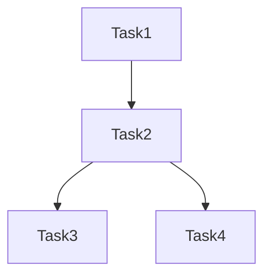

# Workflow Grouping Composition

A Python module for intelligently grouping workflow tasks based on their resource requirements and dependencies. This tool analyzes task characteristics and dependencies to optimize workflow execution by grouping compatible tasks together.

Research for: Optimizing Heterogeneous Workflow Construction for Enhanced Event Throughput and Efficient Resource Utilization in CMS

## Overview

The Workflow Task Grouper analyzes workflow tasks and their relationships to create optimal task groups while respecting both hard constraints (OS compatibility, architecture requirements) and soft constraints (resource utilization, performance characteristics).

## Features

- Task dependency analysis using directed acyclic graphs (DAG)
- Resource compatibility checking
- Configurable scoring system for group optimization
- Support for various resource types (CPU, Memory, GPU)
- Visualization of workflow DAG structure (ASCII and Mermaid formats)
- Customizable weights for different scoring aspects

## Installation

```bash
# Clone the repository
git clone <repository-url>
cd workflow-task-grouper

# Install dependencies
pip install -r requirements.txt
```

## Task Grouping Algorithm

The task grouping algorithm implemented in `group_tasks.py` follows these key steps:

### 1. DAG Construction
- Creates a directed acyclic graph (DAG) representing task dependencies
- Each node represents a task
- Edges represent dependencies between tasks (input/output relationships)

### 2. Group Formation
The algorithm forms groups iteratively:

1. **Initial Selection**:
   - Starts with the task that has the most dependencies (predecessors + successors)
   - This prioritizes tasks that are more interconnected in the workflow

2. **Group Expansion**:
   For each potential task to add to the group, the algorithm checks:

   a. **Hard Constraints**:
   - OS version compatibility
   - CPU architecture compatibility
   - Existence of dependency paths between tasks

   b. **Soft Constraints** (Scoring System):
   - CPU utilization efficiency
   - Memory compatibility
   - Processing throughput alignment
   - Accelerator (GPU) requirements

   c. **Dependency Path Validation**:
   - Ensures all intermediate tasks in dependency paths are included in the group
   - Maintains workflow coherence within groups

### 3. Scoring System

Groups are evaluated using a weighted scoring system (`GroupScore` class) that considers:

- **CPU Score**: Efficiency of CPU core utilization
- **Memory Score**: Compatibility of memory requirements
- **Throughput Score**: Alignment of processing speeds
- **Accelerator Score**: GPU requirement compatibility

Each aspect can be weighted differently using customizable weights, with scores normalized to [0,1].

### 4. Group Finalization

A task is added to a group if:
1. It passes all hard constraints
2. The group's total score remains above the minimum threshold (default: 0.7)
3. All dependency paths between tasks in the group are complete

## Usage

```python
from src.group_tasks import create_workflow_from_json

# Load your workflow JSON
with open("workflow.json", "r") as file:
    workflow_data = json.load(file)

# Create groups with custom minimum score
groups, tasks = create_workflow_from_json(workflow_data, min_group_score=0.7)
```

## Testing

The project includes test suites for different workflow patterns:
- Sequential workflows (`tests/test_sequential.py`)
- Fork workflows (`tests/test_fork.py`)

Run tests using:
```bash
python -m pytest tests/
```

## Visualization

The module supports two visualization formats for workflow DAGs:

### ASCII Format

```
Task1
|-- Task2
    |-- Task3
    |-- Task4
```

### Mermaid Format


## Metrics Analysis and Visualization

The module includes comprehensive metrics analysis and visualization capabilities through `vis_all_groups.py`. This tool generates detailed visualizations to analyze different aspects of task grouping strategies.

### Installation

```bash
pip install matplotlib seaborn pandas
```

### Available Visualizations

1. **Resource Utilization Analysis** (`resource_utilization.png`):
   - CPU Efficiency vs Group Size
   - Memory Efficiency vs Group Size
   - Overall Resource Utilization vs Group Size
   - CPU vs Memory Efficiency (with group size as bubble size)

2. **Throughput and I/O Analysis** (`throughput_analysis.png`):
   - Total Throughput vs Group Size
   - Throughput Range (Min/Max) vs Group Size
   - Total Output Size vs Group Size
   - Throughput vs Output Size (with group size as bubble size)

3. **Dependency Analysis** (`dependency_analysis.png`):
   - Number of Dependency Paths vs Group Size
   - Average Path Length vs Group Size

4. **Metric Correlation Heatmap** (`metric_correlation.png`):
   - Shows correlations between all metrics
   - Helps identify relationships between different aspects of the grouping

### Metrics Tracked

The visualization tool tracks and analyzes the following metrics:

#### CPU Metrics
- Total CPU cores
- Maximum CPU cores
- CPU-seconds (total CPU time required)
- CPU efficiency (ratio of actual CPU usage to allocated CPU-seconds)

#### Memory Metrics
- Total memory (MB)
- Maximum memory (MB)
- Minimum memory (MB)
- Memory-seconds (total memory time required)
- Memory efficiency (ratio of actual memory usage to allocated memory-seconds)

#### Throughput Metrics
- Total events per second
- Maximum events per second
- Minimum events per second

#### I/O Metrics
- Total output size (MB)
- Maximum output file size (MB)

#### Dependency Metrics
- Number of dependency paths
- Average path length
- Complete dependency paths within groups

#### Resource Utilization Metrics
- Overall resource utilization efficiency
- Event throughput

### Usage

```python
from vis_all_groups import visualize_groups

# After getting groups from create_workflow_from_json
visualize_groups(groups, output_dir="my_plots")
```

Or run directly:
```bash
python src/vis_all_groups.py
```

The tool saves both the visualizations and the raw metrics data in JSON format for further analysis.

### Analysis Benefits

The visualizations help:
1. Identify optimal group sizes for different metrics
2. Understand tradeoffs between resource utilization and throughput
3. Analyze dependency patterns
4. Find correlations between different metrics
5. Make informed decisions about task grouping strategies

## Task Grouping Analysis Module

The `group_all_groups.py` module provides a comprehensive framework for analyzing all possible task groupings in a workflow. Unlike the original task grouping algorithm that focused on finding optimal groups, this module generates and analyzes all valid task groupings based on dependency constraints.

### Key Features

- Generates all possible valid task groups based on dependency constraints
- Calculates detailed resource utilization metrics for each group
- Provides comprehensive analysis of CPU, memory, I/O, and dependency patterns
- Supports visualization of grouping strategies and their impacts

### Core Components

1. **Task and Resource Models**:
   ```python
   @dataclass
   class TaskResources:
       os_version: str
       cpu_arch: str
       memory_mb: int
       accelerator: Optional[str]
       cpu_cores: int
       events_per_second: float

   @dataclass
   class Task:
       id: str
       resources: TaskResources
       input_task: Optional[str] = None
       output_tasks: Set[str] = None
   ```

2. **Group Metrics Calculation**:
   - CPU utilization and efficiency
   - Memory allocation and efficiency
   - Throughput analysis
   - I/O requirements
   - Dependency path analysis

3. **Dependency Validation**:
   - Ensures all tasks in a group have valid dependency paths
   - Validates that all intermediate tasks in dependency paths are included
   - Maintains workflow coherence within groups

### Usage Example

```python
from group_all_groups import create_workflow_from_json

# Load workflow specification
with open("workflow.json", "r") as file:
    workflow_data = json.load(file)

# Generate all possible groups and their metrics
groups, tasks = create_workflow_from_json(workflow_data)

# Each group contains detailed metrics:
{
    "group_id": "group_0",
    "task_ids": ["Task1", "Task2", ...],
    "resource_metrics": {
        "cpu": {
            "total_cores": 8,
            "max_cores": 4,
            "cpu_seconds": 1200.0,
            "efficiency": 0.75
        },
        "memory": {
            "total_mb": 16000,
            "max_mb": 8000,
            "min_mb": 4000,
            "memory_seconds": 24000.0,
            "efficiency": 0.6
        },
        # ... other metrics
    }
}
```

### Analysis Workflow

1. **Workflow Parsing**:
   - Loads workflow specification from JSON
   - Creates task and resource models
   - Builds dependency graph

2. **Group Generation**:
   - Generates all possible valid task groups
   - Validates dependency constraints
   - Calculates metrics for each group

3. **Metrics Calculation**:
   - Resource utilization (CPU, memory)
   - Throughput analysis
   - I/O requirements
   - Dependency patterns

4. **Output Generation**:
   - Returns detailed metrics for all groups
   - Provides data for visualization
   - Enables comparison of different grouping strategies

### Integration with Visualization

The module works seamlessly with the visualization tool (`vis_all_groups.py`):
```python
from group_all_groups import create_workflow_from_json
from vis_all_groups import visualize_groups

# Generate groups and visualize
groups, tasks = create_workflow_from_json(workflow_data)
visualize_groups(groups)
```

This integration allows for:
- Visual analysis of different grouping strategies
- Comparison of resource utilization patterns
- Identification of optimal group sizes
- Understanding of tradeoffs between different metrics

## Contributing

Contributions are welcome! Please feel free to submit a Pull Request.

## License

[Add your license information here]