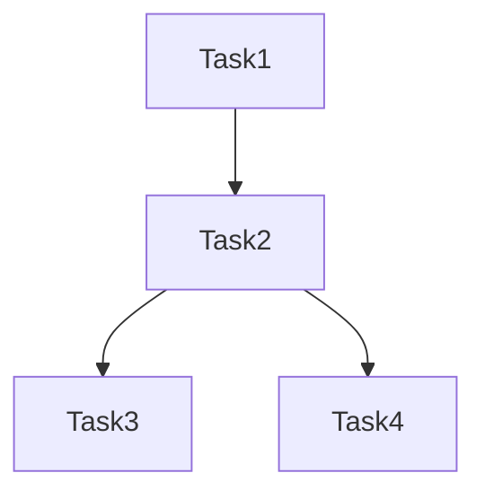

# Workflow Grouping Composition

A Python module for intelligently grouping workflow tasks based on their resource requirements and dependencies. This tool analyzes task characteristics and dependencies to optimize workflow execution by grouping compatible tasks together.

Research for: Optimizing Heterogeneous Workflow Construction for Enhanced Event Throughput and Efficient Resource Utilization in CMS


## Overview

The Workflow Task Grouper analyzes workflow tasks and their relationships to create optimal task groups while respecting both hard constraints (OS compatibility, architecture requirements) and soft constraints (resource utilization, performance characteristics). The system also generates all possible workflow constructions and provides comprehensive analysis and visualization capabilities.

For a realistic 5 steps workflow configuration, under the campaign `Run3Summer23wmLHEGS`, please see [this](https://cmsweb.cern.ch/reqmgr2/fetch?rid=pdmvserv_task_HIG-Run3Summer23wmLHEGS-00565__v1_T_250718_170537_83) workflow.
While a three-task real workflow under the campaign `Run3Summer22EEFSGenPremix` is available at [this](https://cmsweb.cern.ch/reqmgr2/data/request?name=pdmvserv_task_SUS-Run3Summer22EEFSGenPremix-00023__v1_T_250709_092301_5219) link.


## Features

- Task dependency analysis using directed acyclic graphs (DAG)
- Resource compatibility checking
- Configurable scoring system for group optimization
- Support for various resource types (CPU, Memory, GPU)
- Visualization of workflow DAG structure (ASCII and Mermaid formats)
- Customizable weights for different scoring aspects
- Generation of all possible workflow constructions
- Comprehensive workflow construction analysis and comparison
- Mermaid-based HTML workflow topology visualization
- Storage rules and data volume calculation
- Events per job calculation based on target wallclock time
- RequestNumEvents integration for proper metric normalization
- Job scaling analysis and efficiency metrics
- Time analysis with resource constraints (baseline, 100 grid slots, 1000 grid slots)
- Event-based dependency simulation for realistic time estimation
- Job scheduling simulation with event tracking


## Installation

```bash
# Clone the repository
git clone <repository-url>
cd workflow-task-grouper

# Install dependencies
pip install -r requirements.txt
```


## Usage

```python
from src.find_all_groups import create_workflow_from_json

# Load your workflow JSON
with open("workflow.json", "r") as file:
    workflow_data = json.load(file)

# Generate all possible groups and workflow constructions
groups, tasks, construction_metrics, dag = create_workflow_from_json(workflow_data)
```


## Testing

The project includes test suites for different workflow patterns:
- Sequential workflows (`tests/test_sequential.py`)
- Fork workflows (`tests/test_fork.py`)

Run tests using:
```bash
python -m pytest tests/
```


## Visualization

The module supports two visualization formats for workflow DAGs:

### ASCII Format

```
Task1
|-- Task2
    |-- Task3
    |-- Task4
```

### Mermaid Format



## Comprehensive Workflow Analysis Module

The `find_all_groups.py` module provides a comprehensive framework for analyzing all possible task groupings and workflow constructions in a workflow. This module generates and analyzes all valid task groupings based on dependency constraints and finds all possible ways to construct workflows from these groups.

### Key Features

- Generates all possible valid task groups based on dependency constraints
- Calculates detailed resource utilization metrics for each group
- Finds all possible workflow constructions (combinations of groups that cover all tasks)
- Calculates comprehensive workflow-level metrics
- Implements storage rules for data volume calculation
- Calculates optimal events per job based on target wallclock time
- Provides comprehensive analysis of CPU, memory, I/O, and dependency patterns
- Supports visualization of grouping strategies and their impacts

### Core Components

1. **Task and Resource Models**:
   ```python
   @dataclass
   class TaskResources:
       os_version: str
       cpu_arch: str
       memory_mb: int
       accelerator: Optional[str]
       cpu_cores: int
       events_per_second: float
       time_per_event: float
       size_per_event: float
       input_events: int
       keep_output: bool  # Whether the task's output needs to be kept in shared storage

   @dataclass
   class Task:
       id: str
       resources: TaskResources
       input_task: Optional[str] = None
       output_tasks: Set[str] = None
       order: int = 0  # Order of the task in the workflow
   ```

2. **Group Metrics Calculation**:
   - CPU utilization and efficiency
   - Memory allocation and efficiency
   - Throughput analysis
   - I/O requirements with storage rules
   - Dependency path analysis
   - Events per job calculation

3. **Workflow Construction Analysis**:
   - Finds all possible combinations of groups that cover all tasks
   - Respects task dependencies between groups
   - Calculates workflow-level metrics including:
     - Event throughput and CPU time per event
     - Total data volumes (remote read, local write, remote write)
     - Memory scaling and network transfer metrics
     - Job scaling and efficiency metrics
     - Time analysis with resource constraints (baseline, 100 grid slots, 1000 grid slots)
     - Event dependency calculation for realistic time estimation

4. **Storage Rules**:
   - Input data volume based on parent task's size per event
   - Output data volume for all tasks in the group
   - Stored data volume for tasks with `keep_output=True` or exit point tasks
   - Per-event data volume calculations

5. **Events per Job Calculation**:
   - Based on target wallclock time (default: 12 hours)
   - Calculates optimal events per job for each group
   - Ensures consistent event processing across workflow

6. **RequestNumEvents Integration**:
   - Enables proper normalization of workflow metrics
   - Scales all metrics (CPU time, I/O, memory) with job requirements
   - Calculates group_jobs_needed for each group
   - Provides realistic workflow-level analysis


## 📊 Metrics Documentation

The workflow construction analysis system calculates comprehensive metrics for both individual task groups and complete workflow constructions. These metrics provide insights into performance, resource utilization, and data flow characteristics.

### Available Documentation

📖 **[Workflow Construction Metrics](docs/workflow_construction_metrics.md)** - Detailed metrics for workflow-level analysis

📖 **[Group Metrics](docs/group_metrics.md)** - Comprehensive group-level metrics and calculations

📖 **[Visualization and Analysis](docs/visualization_analysis.md)** - Visualization tools and analysis capabilities


### Key Insights

- Output data per event is constant across all constructions
- Throughput generally decreases with more groups due to overhead
  - However, more groups are meant to improve CPU utilization and Memory occupancy
- Stored data per event varies based on grouping strategy and exit points
- Group-level resource utilization affects overall workflow efficiency

### Example Data

All examples in the documentation are based on real data from `output/fork/5tasks/construction_metrics.json`, providing concrete values for understanding the metrics in practice.


## 📈 Visualization and Analysis

The module includes comprehensive metrics analysis and visualization capabilities through `vis_all_groups.py`. This tool generates detailed visualizations to analyze different aspects of task grouping strategies and workflow constructions.

### Quick Start

```bash
# Install dependencies
pip install matplotlib seaborn pandas

# Basic usage
python src/vis_all_groups.py tests/sequential/3tasks.json

# Toy model mode for simplified analysis
python src/vis_all_groups.py tests/sequential/5tasks.json --toy-model
```

### Available Visualizations

The tool generates 10 different visualization types including resource utilization analysis, throughput analysis, dependency analysis, job scaling analysis, time analysis, and interactive workflow topology diagrams.

📖 **[Detailed Visualization Documentation](docs/visualization_analysis.md)** - Complete guide to visualization capabilities and usage

## 📊 Workflow Construction Statistics Analyzer

The `const_stats.py` module provides comprehensive statistical analysis of workflow construction metrics from JSON files. This tool calculates detailed statistical measures for key performance parameters to help analyze and compare different workflow constructions.

### Key Features

- **Comprehensive Statistics**: Median, average, standard deviation, min, max, quartiles, coefficient of variation
- **Default Metrics**: Analyzes `write_remote_per_event_mb`, `event_throughput`, `memory_per_event_mb`, and `network_transfer_per_event_mb`
- **Flexible Output**: Console display, JSON file output, and summary comparison tables
- **Command Line Interface**: Easy-to-use CLI with various options

### Quick Start

```bash
# Basic analysis of all default metrics
python src/const_stats.py output/others/5tasks_fullsim/construction_metrics.json

# Show only summary comparison table
python src/const_stats.py input.json --summary-only

# Show only speedup analysis table
python src/const_stats.py input.json --speedup-only

# Show only values summary table
python src/const_stats.py input.json --values-only

# Analyze specific metrics only
python src/const_stats.py input.json -m event_throughput memory_per_event_mb

# Custom output file
python src/const_stats.py input.json -o custom_stats.json
```

### Programmatic Usage

```python
from const_stats import analyze_workflow_metrics, generate_summary_table

# Analyze metrics
results = analyze_workflow_metrics('path/to/file.json')

# Generate summary table
summary = generate_summary_table(results)
print(summary)

# Access specific statistics
if 'event_throughput' in results:
    throughput_stats = results['event_throughput']
    mean_throughput = throughput_stats['mean']
    cv_throughput = throughput_stats['cv']
```

### Example Output

The analyzer provides both detailed statistics and a summary comparison table:

```
SUMMARY COMPARISON TABLE
====================================================================================================
Metric                                    COUNT         MIN         MAX        MEAN      MEDIAN     STD_DEV         CV     SPEEDUP
----------------------------------------------------------------------------------------------------
write_remote_per_event_mb                    16    0.573242    1.681641    1.127441    1.127441    0.421991      0.374       2.934
event_throughput                             16    0.015922    0.026258    0.022318    0.023130    0.004253      0.191       1.649
memory_per_event_mb                          16    1.302000    1.458000    1.380000    1.380000    0.079024      0.057       1.120
network_transfer_per_event_mb                16    0.573242    3.333984    1.953613    1.953613    0.871868      0.446       5.816
----------------------------------------------------------------------------------------------------
```

### Statistical Measures

- **Basic**: count, min, max, range, mean, median
- **Variability**: standard deviation, variance, coefficient of variation (CV)
- **Percentiles**: Q1 (25th), Q3 (75th), interquartile range (IQR)
- **Speedup Analysis**: maximum speedup, mean/min ratio, max/mean ratio

### Interpretation Guide

- **CV < 0.15**: Low variability (consistent performance)
- **CV 0.15-0.35**: Moderate variability
- **CV > 0.35**: High variability (inconsistent performance)

### Speedup Analysis

The analyzer calculates **maximum achievable speedup** for each metric:

- **Speedup Factor**: `max_value / min_value` - shows the potential improvement from worst to best case
- **Mean/Min Ratio**: `mean_value / min_value` - shows improvement from current average to best case
- **Max/Mean Ratio**: `max_value / mean_value` - shows how much better the best case is than average

**Speedup Categories:**
- **≥ 5x**: Very high potential for optimization
- **2-5x**: High potential for optimization
- **1.5-2x**: Moderate potential for optimization
- **< 1.5x**: Low potential for optimization

### Values Analysis

The analyzer provides comprehensive access to all raw values for each metric:

- **Detailed Statistics**: Each metric shows all values in ascending order for intermediate analysis
- **Values Summary Table**: Compact table showing first 10 values for each metric (V1, V2, V3...)
- **Intermediate Speedup Calculations**: Analyze speedup between any two values, not just min/max
- **Distribution Analysis**: See the actual distribution of values to identify patterns

**Example Values Output:**
```
All Values (Ascending Order):
------------------------------
      0.573242      0.573242      0.573242      0.573242      0.963867      0.963867
      0.963867      0.963867      1.291016      1.291016      1.291016      1.291016
      1.681641      1.681641      1.681641      1.681641

Total: 16 values
```

This allows you to calculate speedup between intermediate values, such as:
- Speedup from V1 to V5: `0.963867 / 0.573242 = 1.68x`
- Speedup from V8 to V16: `1.681641 / 1.291016 = 1.30x`

See `src/example_usage.py` for comprehensive usage examples and advanced analysis techniques.

## Contributing

Contributions are welcome! Please feel free to submit a Pull Request.
